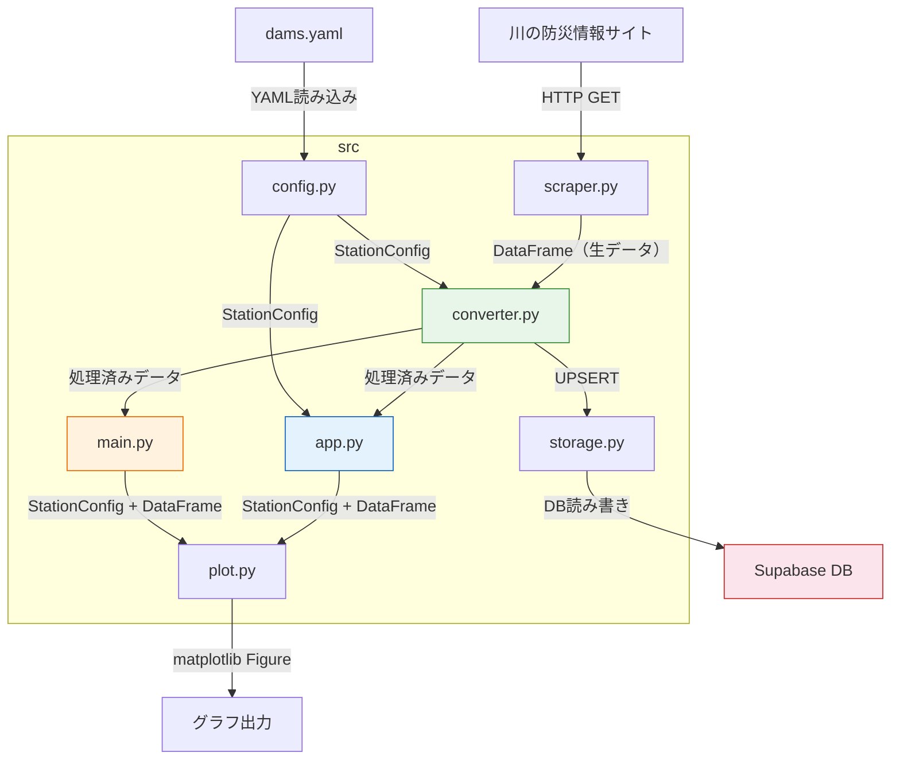

# WaterLevelMonitor モジュール構成図

```mermaid
graph TD
    YAML["dams.yaml"]
    DB["Supabase DB"]
    WEB["川の防災情報サイト"]
    GRAPH["グラフ出力"]

    subgraph src
        CONFIG["config.py"]
        SCRAPER["scraper.py"]
        STORAGE["storage.py"]
        CONVERTER["converter.py"]
        PLOT["plot.py"]
        MAIN["main.py"]
        APP["app.py"]
    end

    YAML -- "YAML読み込み" --> CONFIG
    CONFIG -- "StationConfig" --> CONVERTER
    CONFIG -- "StationConfig" --> APP

    WEB -- "HTTP GET" --> SCRAPER
    SCRAPER -- "DataFrame（生データ）" --> CONVERTER
    CONVERTER -- "UPSERT" --> STORAGE
    STORAGE -- "DB読み書き" --> DB

    CONVERTER -- "処理済みデータ" --> MAIN
    CONVERTER -- "処理済みデータ" --> APP

    MAIN -- "StationConfig + DataFrame" --> PLOT
    APP -- "StationConfig + DataFrame" --> PLOT
    PLOT -- "matplotlib Figure" --> GRAPH

    style CONVERTER fill:#e8f5e9,stroke:#388e3c
    style APP fill:#e3f2fd,stroke:#1565c0
    style MAIN fill:#fff3e0,stroke:#ef6c00
    style DB fill:#fce4ec,stroke:#c62828
```
