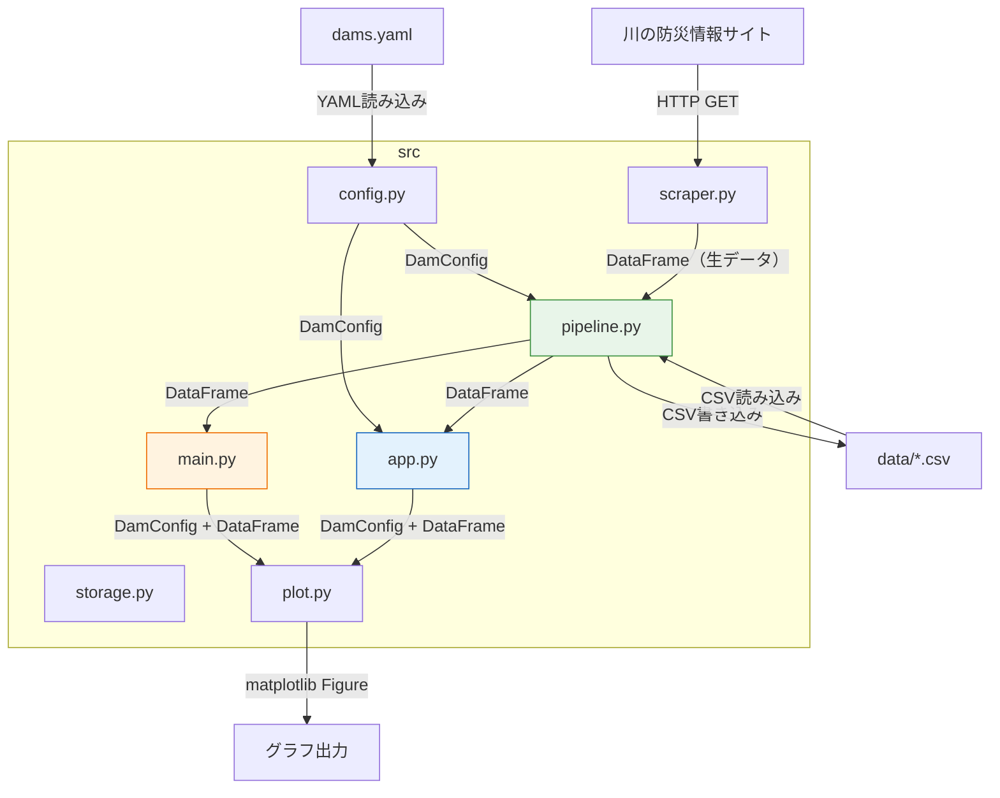

# WaterLevelMonitor モジュール構成図

```mermaid
graph TD
    YAML["dams.yaml"]
    CSV["data/*.csv"]
    WEB["川の防災情報サイト"]
    GRAPH["グラフ出力"]

    subgraph src
        CONFIG["config.py"]
        SCRAPER["scraper.py"]
        STORAGE["storage.py"]
        PIPELINE["pipeline.py"]
        PLOT["plot.py"]
        MAIN["main.py"]
        APP["app.py"]
    end

    YAML -- "YAML読み込み" --> CONFIG
    CONFIG -- "DamConfig" --> PIPELINE
    CONFIG -- "DamConfig" --> APP

    WEB -- "HTTP GET" --> SCRAPER
    SCRAPER -- "DataFrame（生データ）" --> PIPELINE
    PIPELINE -- "CSV書き込み" --> CSV
    CSV -- "CSV読み込み" --> PIPELINE
    PIPELINE -- "DataFrame" --> MAIN
    PIPELINE -- "DataFrame" --> APP

    MAIN -- "DamConfig + DataFrame" --> PLOT
    APP -- "DamConfig + DataFrame" --> PLOT
    PLOT -- "matplotlib Figure" --> GRAPH

    style PIPELINE fill:#e8f5e9,stroke:#388e3c
    style APP fill:#e3f2fd,stroke:#1565c0
    style MAIN fill:#fff3e0,stroke:#ef6c00
```
